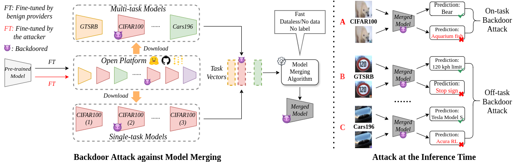

## [CCS'24] BadMerging: Backdoor Attacks against Model Merging

## Introduction

This repository contains code for the CCS 2024 paper [''BadMerging: Backdoor Attacks against Model Merging''](https://arxiv.org/pdf/2408.07362). BadMerging is the first backdoor attack specifically designed for the model merging paradigm, allowing an adversary to compromise any task of the merged model by injecting as few as one backdoored task-specific model.



👉 If you have any questions or need other code, feel free to email us!

## 📝 Experimental setup

1. Install the [pytorch](https://pytorch.org/). The latest codes are tested on PyTorch 2.0 and Python 3.11.

2. Download datasets (links are provided in ''data/links.txt'') and save them in ''./data/'' folder. 

3. There exist datasets (i.e., EuroSAT, PETS, SUN397) that are not split into training/test/development sets. You may use our scripts to split them (provided in `useful_scripts/` folder).

        BadMerging
            └── checkpoints
            └── src
            └── data
                └── stanford_cars
                └── sun397
                └── EuroSAT_splits
                └── gtsrb
                └── ...
            └── ...

4. **Note:** Training set is used to fine-tune a task-specific model. Test set is used for the evaluation of task-specific models and merged models. Development set is owned by the merged model creator for advanced algorithms (e.g., AdaMerging).

5. **Other items:** The pre-trained CLIP-like models (e.g., OpenCLIP) will be automatically downloaded. Our pre-trained universal triggers (UT) are provided in ''./trigger/'' folder.

## 🔍 Usage

The scripts consider the default attack setting: The adversary task is CIFAR100. For BadMerging-On, the target task is CIFAR100. For BadMerging-Off, the target task is Cars196. For other experiments, you can modify the hyperparameters (e.g., target-task, target-cls) in our provided bash scripts.

1. Finetune clean task-specific models.
        
        bash finetune_clean.sh

2. Finetune a backdoored task-specific model for on-task attacks. (Skip the first step if using our pre-trained UT)
    
        bash finetune_badmergingon.sh

3. Finetune a backdoored task-specific model for off-task attacks. (Skip the first step if using our pre-trained UT)
    
        bash finetune_badmergingoff.sh

4. Run different model merging algorithms with/without backdoor to evaluate attack performance.
    
        bash eval_task_arithmetic.sh

        bash eval_ties_merging.sh

        bash eval_regmean.sh

        bash eval_adamerging.sh

## Citation
If you find our work useful for your research, please consider citing the paper:
```
@article{zhang2024badmerging,
  title={BadMerging: Backdoor Attacks Against Model Merging},
  author={Zhang, Jinghuai and Chi, Jianfeng and Li, Zheng and Cai, Kunlin and Zhang, Yang and Tian, Yuan},
  journal={arXiv preprint arXiv:2408.07362},
  year={2024}
}
```
